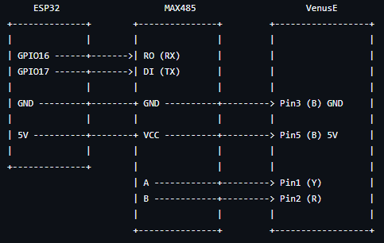
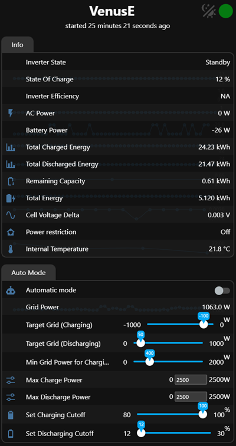
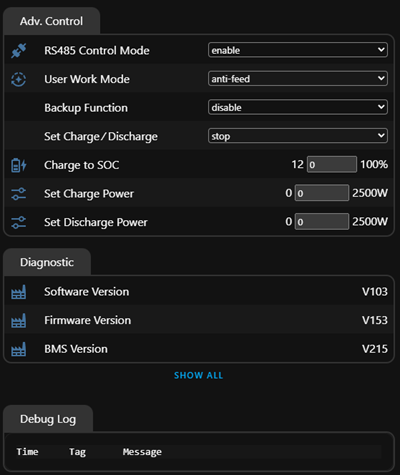

# esphome-marstek-venus-rs485

Standalone ESPHome-based controller for **Marstek Venus E 2.0** over RS485 (ESP32).

## Overview

The Venus E 2.0 often suffers from unstable Wi-Fi, making direct integration with Home Assistant unreliable.  
This project uses an ESP32 running ESPHome to control the device independently, with grid data provided via MQTT.

## References

- https://gathering.tweakers.net/forum/list_messages/2282240 (wiring)
- https://github.com/Superduper1969/MarstekVenus-LilygoRS485 (Modbus readout)
- https://du.nkel.dev/blog/2026-01-11_marstek-battery-homeassistant/ (control loop)

## Hardware

- ESP32 Dev Kit  
- MAX485 module  

## Wiring



## Current Controls




## Configuration

The setup expects a single MQTT topic providing grid power data:

- **Grid power > 0** → battery will discharges  
- **Grid power < 0** → battery will charge  

Inverter efficiency values are reported as follows:

- **Negative values** → battery is charging  
- **Positive values** → battery is discharging  

## Notes

- The discharge power restriction must be configured via the official app. After initial setup, the app is no longer required.  
- The factory reset button has not yet been tested.
- Grid data from a Hichi meter can be fetched every second using a Tasmota script, for example.

```tasmota
    >D
    MQT = "Hichi"
    >B
    =>sensor53 r
    >M
    <YOUR M Section for the SML>
    >S
    =>publish %MQT%/Grid %4sml[1]%
``` 

## ToDo

- Add a logic level shifter to reduce ESP32 RX/TX voltage to 3.3V
